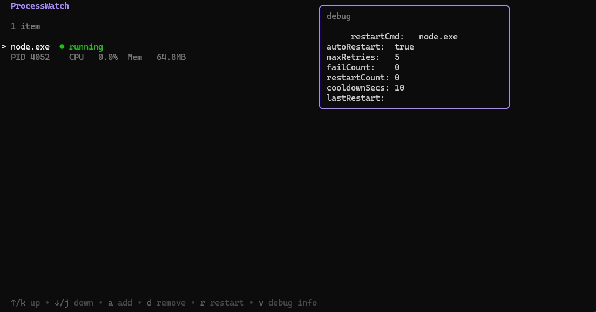
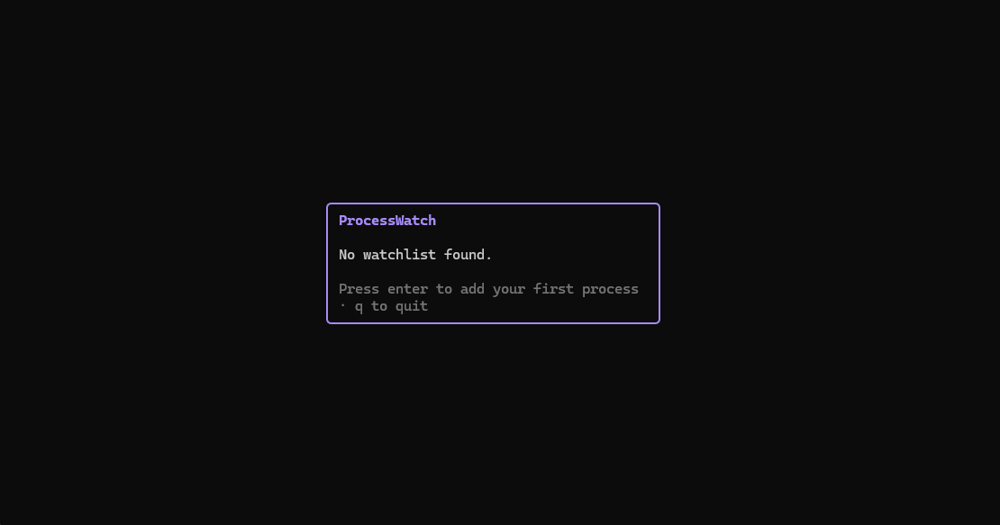
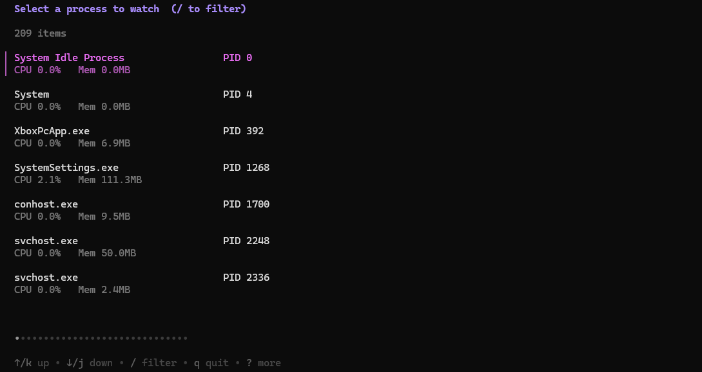

# ProcessWatch


ProcessWatch is a cross-platform process monitoring agent with a terminal UI, structured local logs, optional recovery commands, and hosted dashboard reporting through [processwatch.dev](https://processwatch.dev).

The agent is designed for small production systems, freelance client apps, home servers, game servers, side projects, and other setups where you want lightweight host/process visibility without a heavyweight observability stack. It pairs well with full APM or log aggregation tools rather than replacing them.



## What It Does

- **Monitor processes locally** - Track running/stopped state, PID, CPU, memory, uptime, and restart counts from a terminal UI.
- **Report to the hosted dashboard** - Send host metrics, process states, and lifecycle events to ProcessWatch for history, incidents, graphs, and notifications.
- **Alert on failures** - Get dashboard-managed Discord, Slack, email, or webhook notifications depending on your plan.
- **Run optional recovery commands** - Let the agent execute a command when a watched process is down, with cooldowns and retry limits.
- **Run headless** - Use the TUI to configure a watchlist, then run the agent in the background for unattended monitoring.
- **Keep local logs** - Browse structured JSONL events directly from the TUI or inspect `logs/events.jsonl`.
- **Work cross-platform** - Windows, Linux, and macOS builds are supported.

ProcessWatch is monitoring-first. Auto-restart is useful, but optional. For many services, the best recovery mechanism is still your platform's service manager, such as systemd, Docker, PM2, Supervisor, or Windows Services.

## Quick Start

### Download

Download the latest release for your OS and architecture from:

```text
https://github.com/ProcessWatch/agent/releases/latest
```

Unzip the archive, place the binary somewhere convenient, then run:

```bash
./process-watch
```

On Windows:

```powershell
.\process-watch.exe
```

### Build From Source

If you want to build the agent yourself:

```bash
git clone https://github.com/ProcessWatch/agent.git
cd agent
go build -o process-watch .
```

## Dashboard Reporting

The hosted dashboard is where ProcessWatch becomes most useful across multiple hosts. It provides centralized host/process status, incident history, metric timelines, notification settings, and plan-based retention.

To connect a host:

1. Create an account at [processwatch.dev](https://processwatch.dev).
2. Add a host from the dashboard.
3. Copy the generated API key.
4. Uncomment the reporting block in `config.yaml` and paste in the key.

```yaml
reporting:
  enabled: true
  apiKey: "pw_live_..."
```

Once enabled, the agent sends a heartbeat on every poll cycle with host metrics, watched process states, and any lifecycle events that occurred. Notifications are configured in the dashboard, not in the local agent.

> A free Community account supports 1 hosted dashboard host with Discord notifications. Paid plans add more hosts, longer retention, additional notification channels, metric alerts, exports, webhooks, and status pages.

## TUI Usage

On startup, the TUI prompts you to load an existing watchlist or start fresh.



### Controls

| Key | Action |
|-----|--------|
| `a` | Add a process to the watchlist |
| `d` | Remove selected process |
| `r` | Manually run the selected process recovery command |
| `v` | Toggle debug info panel |
| `e` | Open event log viewer |
| `q` | Quit from the main dashboard |

### Adding a Process

Press `a` to open the process picker. Select a running process to add it to the watchlist.

By default, new processes are added in monitor-only mode:

```text
Auto-restart: false
```

In this mode, ProcessWatch monitors the process, reports its status, creates dashboard incidents, and sends configured notifications, but it will not attempt to restart the process.

If you set `Auto-restart` to `true`, the TUI shows restart settings:

- `Restart command`
- `Max retries`
- `Cooldown (secs)`



## Recovery Commands

The watched process name and restart command are intentionally separate.

ProcessWatch can detect a process named `firefox.exe`, `node`, `my-server`, or `java`, but that does not mean the process name itself is a reliable restart command. The restart command should be something that works from a plain shell and returns after starting or restarting the service.

Good command patterns:

```bash
systemctl restart my-app
docker restart my-container
docker compose up -d web
pm2 restart api
supervisorctl restart worker
```

Windows examples:

```powershell
powershell -Command "Restart-Service MyService"
powershell -Command "Start-Process 'C:\path\to\app.exe'"
cmd /c start "" "C:\path\to\app.exe"
```

Less reliable:

```text
my-app.exe
node
firefox.exe
```

Those only work if the executable is on `PATH`, the working directory is correct, and the process can be launched correctly from the agent's shell environment.

Recommended approach:

- Use monitor-only mode when you only want incidents and notifications.
- Use service-manager commands for production services.
- Test recovery commands manually in the same shell/user context before relying on them.
- Prefer commands that return promptly after starting the service.

## Headless Mode

Headless mode runs the watcher without the TUI:

```bash
./process-watch --headless
```

On Windows:

```powershell
.\process-watch.exe --headless
```

Headless mode requires an existing watchlist. Run the TUI once first to create `watchlist.json`, then start the agent headlessly.

## Configuration

`config.yaml` is created automatically on first run with sensible defaults. The reporting block is commented out by default; uncomment it once you have a dashboard API key.

```yaml
# ProcessWatch configuration
pollIntervalSecs: 5
restartVerifyDelaySecs: 3   # seconds to wait after restart before checking health
logLevel: info              # info | debug

# reporting: configure to send metrics to a ProcessWatch dashboard
# reporting:
#   enabled: true
#   apiKey: "pw_live_..."
```

| Option | Description | Default |
|--------|-------------|---------|
| `pollIntervalSecs` | How often the agent checks watched processes and sends dashboard heartbeats | `5` |
| `restartVerifyDelaySecs` | Delay after a recovery command before verifying the process is healthy | `3` |
| `logLevel` | Log verbosity (`info` or `debug`) | `info` |
| `reporting.enabled` | Enables hosted dashboard reporting | `false` |
| `reporting.apiKey` | API key generated by the dashboard for this host | empty |

Lower poll intervals report faster but increase local and network activity. The dashboard ingest API is rate-limited, so avoid setting this below the documented minimum.

## Watchlist

The watchlist is stored in `watchlist.json` next to the executable. Each entry tracks:

- Process name
- Optional restart command
- Auto-restart toggle
- Max retries and cooldown period
- Restart/failure counters
- Last restart timestamp

## Event Logs

Events are logged to `logs/events.jsonl` in structured JSON format. Log rotation is automatic.

From the TUI, press `e` to open the event log viewer. Use `/` to filter by event type, process name, or data field. Press `q` to return to the dashboard.

## Project Structure

```text
process-watch/
|-- main.go                        # Entry point, CLI flags, wiring
|-- screenshots/                   # Screenshots for README
`-- internal/
    |-- config/config.go           # Config loading and validation
    |-- core/
    |   |-- types.go               # Core data types
    |   `-- contracts.go           # Interfaces
    |-- logger/logger.go           # JSONL logger with rotation
    |-- monitor/watcher.go         # Polling loop, liveness checks, recovery commands
    |-- process/manager.go         # OS process operations via gopsutil
    |-- storage/watchlist.go       # JSON-backed watchlist persistence
    |-- reporting/reporter.go      # Heartbeat reporter for remote ingest API
    `-- tui/
        |-- app.go                 # Bubble Tea bootstrap
        |-- model.go               # Top-level TUI model and routing
        `-- views/
            |-- welcome.go         # Startup screen
            |-- list.go            # Main dashboard view
            |-- picker.go          # Process picker and add form
            `-- logs.go            # Event log viewer
```

## Roadmap

- Config hot-reload
- Recovery command test action in the TUI
- Process grouping/tagging
- More deployment examples for Linux VPSes and Windows services

## License

MIT License - see [LICENSE](LICENSE) for details.